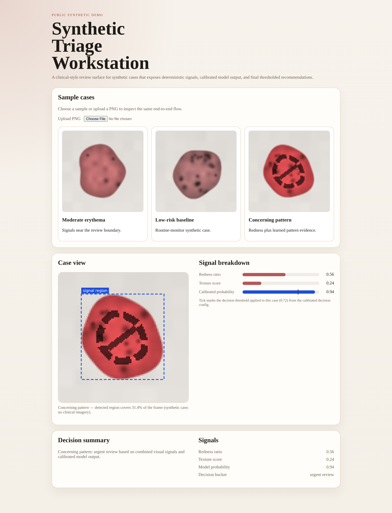

# Clinical Inference Workstation

[](https://github.com/njchae/clinical-inference-workstation/actions/workflows/ci.yml)

A portfolio-safe analogue of applied ML work across clinical imaging pathways — a synthetic
triage workstation built to demonstrate evaluation discipline, hybrid feature engineering,
inference service design, and agentic label adjudication without exposing private code or
clinical data.



*Live inference on deliberately abstract synthetic cases — no clinical imagery appears
anywhere in this repo. See [`docs/portfolio-context.md`](docs/portfolio-context.md) for
the public scope and provenance of the project.*

## Key Results

These are inspectable in the committed artifacts, not just claimed in prose.

**Calibration** — the runnable synthetic pipeline keeps calibration, threshold selection,
and final held-out evaluation as separate stages. It makes probability behavior and
decision thresholds inspectable rather than treating a single aggregate metric as sufficient. See
[`artifacts/latest/calibration.json`](artifacts/latest/calibration.json) and
[`artifacts/latest/MODEL_CARD.md`](artifacts/latest/MODEL_CARD.md).

**Model comparison** — both model families (logistic regression and compact CNN) were
evaluated through the same split, calibration, and threshold pipeline. The comparison
demonstrates that model complexity does not substitute for an appropriate data and feature
strategy. See
[`artifacts/latest/comparison.json`](artifacts/latest/comparison.json).

**Agentic adjudication** — a 4-stage workflow with committed prompt contracts, validated
stage outputs, and three explicit routing decisions (`accept`, `needs_human_review`,
`reject_for_insufficient_evidence`). It demonstrates a bounded, review-aware pattern for
machine-assisted labeling. See [`artifacts/latest/adjudication_comparison_example.json`](artifacts/latest/adjudication_comparison_example.json)
and [`docs/agentic-adjudication.md`](docs/agentic-adjudication.md).

**Inference service** — auth-aware FastAPI with request-scoped audit log and signal-region
localization returned per request (rendered as the bounding-box overlay above). See
[`artifacts/latest/api_response_example.json`](artifacts/latest/api_response_example.json)
and [`artifacts/latest/audit_log_example.jsonl`](artifacts/latest/audit_log_example.jsonl).

## Professional Context

The design is informed by private applied work across AOM, impetigo, sore throat, infected
insect-bite, and additional clinical-imaging pathways. That work used per-pathway evaluation,
calibration, human-review routing, and cloud-service delivery patterns. Exact dataset sizes,
clinical operating points, production measurements, and private infrastructure are deliberately
omitted. See [`docs/portfolio-context.md`](docs/portfolio-context.md).

## Repo Map

| Topic | Where |
|-------|-------|
| Methodology & evaluation discipline | [`docs/methodology.md`](docs/methodology.md) |
| Model comparison & model card | [`artifacts/latest/comparison.json`](artifacts/latest/comparison.json) · [`artifacts/latest/MODEL_CARD.md`](artifacts/latest/MODEL_CARD.md) |
| Architecture & inference service | [`docs/architecture.md`](docs/architecture.md) · [`src/clinical_inference_workstation/api/`](src/clinical_inference_workstation/api/) |
| Agentic adjudication | [`docs/agentic-adjudication.md`](docs/agentic-adjudication.md) · [`configs/adjudication_prompts/`](configs/adjudication_prompts/) |
| DOE parameter sweeps | [`docs/doe-parameter-sweeps.md`](docs/doe-parameter-sweeps.md) |
| Guided tour (5–7 min) | [`docs/demo-walkthrough.md`](docs/demo-walkthrough.md) |
| Capability map | [`docs/capability-map.md`](docs/capability-map.md) |
| Portfolio context | [`docs/portfolio-context.md`](docs/portfolio-context.md) |

## Quickstart

```bash
python -m venv .venv
source .venv/bin/activate
pip install -e ".[dev]"
python scripts/bootstrap_demo.py
python scripts/run_api.py
```

(`npm install` is only needed for the Playwright browser tests — see Verification.)

Then:

1. Open `http://127.0.0.1:8000/`.
2. Click `Concerning pattern` in the workstation.
3. Inspect [`artifacts/latest/api_response_example.json`](artifacts/latest/api_response_example.json).
4. Inspect [`artifacts/latest/audit_log_example.jsonl`](artifacts/latest/audit_log_example.jsonl).
5. Inspect [`artifacts/latest/MODEL_CARD.md`](artifacts/latest/MODEL_CARD.md).

For a guided 5–7 minute tour: [Demo Walkthrough](docs/demo-walkthrough.md).

## Repo Layout

```text
clinical-inference-workstation/
├── artifacts/          # Curated public demo artifacts
├── configs/            # Decision rules, thresholds, and committed prompt templates
├── docs/               # Architecture, methodology, deployment, and role evidence
├── output/             # Local runtime outputs generated while running the demo
├── scripts/            # Bootstrap, training, labeling, and verification commands
├── src/                # Python package
├── tests/              # Unit, integration, API, and browser coverage
└── web/                # Thin workstation UI
```

## Useful Commands

```bash
# Generate or refresh model artifacts and sample cases
python scripts/generate_dataset.py

# Train the tiny model bundle
python scripts/train_model.py

# Train the compact CNN bundle (compare against baseline_linear)
python scripts/train_model.py --model-family compact_cnn

# Calibrate probabilities and derive review threshold
python scripts/calibrate_model.py

# Evaluate the calibrated model on held-out synthetic data
python scripts/evaluate_model.py

# Run the DOE parameter sweep over temperature x threshold (validation split)
python scripts/run_doe_sweep.py --split validation

# Render the Markdown algorithm report from committed artifacts
python scripts/generate_report.py

# Run structured labeling over synthetic images
python scripts/label_images.py --images-dir web/samples --provider local --checkpoint-path output/labels/checkpoint.json --output-path output/labels/results.json --review-queue-path output/labels/review_queue.jsonl

# Run staged adjudication over weak labels
python scripts/run_adjudication_workflow.py --labels-path output/labels/results.json --output-path output/adjudication/results.json --trace-path output/adjudication/trace.json --escalation-path output/adjudication/escalations.jsonl --provider local

# Export accepted review decisions for training/evaluation
python scripts/export_reviewed_labels.py --labels-path output/labels/results.json --export-path output/labels/training_labels.json

# Verify a deployed service surface
python scripts/verify_deployment.py --base-url http://127.0.0.1:8000

# One-command demo bootstrap
python scripts/bootstrap_demo.py

# Run tests
pytest tests -q
npm run test:e2e

# Serve API + workstation
python scripts/run_api.py
```

Common workflows are also wrapped as `Makefile` targets — e.g. `make sweep`, `make report`,
`make test` (run `make help` for the full list).

## Verification

```bash
pytest tests -q
npm install && npx playwright install chromium   # first run only
npm run test:e2e
python scripts/verify_deployment.py --base-url http://127.0.0.1:8000
```

Coverage notes:

- `pytest` covers the Python API, inference, config, labeling, and documentation surface.
- Playwright covers the workstation flow locally and can reuse a system Chrome build when
  `PLAYWRIGHT_CHROMIUM_EXECUTABLE_PATH` is set, otherwise it uses Playwright's standard
  browser resolution.
- The Azure deployment workflow is a public reference scaffold, not proof of a live hosted
  environment.

## What's Inside

- Evaluation discipline: calibration, sensitivity-constrained threshold selection, and
  held-out test evaluation as separate pipeline steps — not one training command.
- Hybrid feature engineering: deterministic signal extraction plus small learned model
  families exported as inspectable artifacts.
- Production-minded service design: FastAPI with auth-aware request handling, request IDs,
  and audit persistence.
- Signal localization: detected-region bounding box computed per request and rendered as
  an overlay in the workstation UI.
- Human-in-the-loop labeling: structured label generation, checkpointing, review queue
  export, and reviewed-label export.
- Agentic orchestration: staged adjudication with explicit prompt contracts, output
  validation, policy checking, and three-way routing — not prompt chaining.
- Tooling and automation: a DOE parameter-sweep harness over the operating point, a report
  generator, and a `Makefile` task runner — analyses run without manual steps. See
  [`docs/doe-parameter-sweeps.md`](docs/doe-parameter-sweeps.md).

## Non-Diagnostic Disclaimer

This is a synthetic portfolio demo. It is not a medical device, not a diagnostic system,
and not intended for real clinical use.
