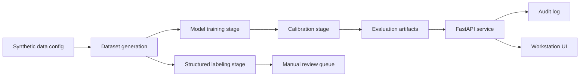

# Architecture

## Overview

The repo is intentionally small but split along the same seams I would use in a larger applied ML product:

- `ml/` owns synthetic data generation, feature extraction, baseline-linear plus compact-CNN training, calibration, and artifact export.
- `api/` owns HTTP boundaries, JWT-gated request handling, audit persistence, and serving the workstation.
- `labeling/` owns structured-label generation, checkpointing, and human-review export.
- `web/` owns the operator-facing review surface.

## Flow

1. `scripts/bootstrap_demo.py` generates public-safe sample images and trains the tiny model.
2. The training pipeline supports `baseline_linear` and `compact_cnn` families and exports `model.json`, `metrics.json`, `thresholds.json`, `calibration.json`, `comparison.json`, and `MODEL_CARD.md`.
3. The labeling pipeline emits typed label outputs, checkpoint state, and a manual review queue.
4. The FastAPI service loads the exported model bundle if present and can require bearer-token auth in deployed mode.
5. Uploaded images are analyzed by:
   - deterministic signal extraction
   - small-model scoring
   - configuration-driven triage decision logic
   - request-scoped audit persistence
6. The workstation UI presents the resulting signals, calibrated score, and recommendation.
